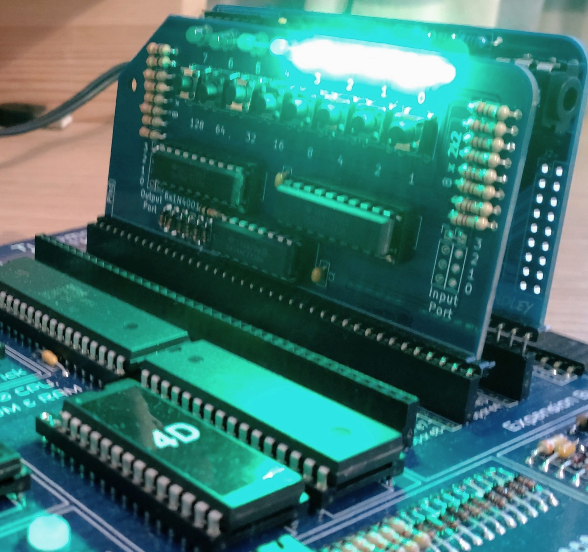

# 3D Monster Maze for the Jupiter Ace (16k)/ Minstrel 4th

This is a port of the classic ZX81 game "3D Monster Maze" to the Jupiter Ace and Minstrel 4th/ 4D.

The game was written by Malcolm Evans and published by J.K. Greye software in 1982. It was one of the first examples of a 3D arcade game for a home computer and was considered an amazing feat, given the limited capabilities of the humble ZX81.

The Jupiter Ace had many similarities to the ZX81, built around the Z80 processor and with a simple, character-based display: but, whereas the ZX81 shipped with BASIC as its built-in language, the Jupiter Ace shipped with FORTH.

FORTH was chosen for the Jupiter Ace, because it produced lean and fast programs, allowing the user to write effective applications, even within the constrained memory of the base model (3 kilobytes).

This port of 3D Monster Maze aims to exploit the capabilities of the Jupiter Ace's built-in FORTH interpetter, while reproducing the original game as accurately as possible, favouring FORTH over machine code whenever possible.

At the heart of the game code is a 3D viewer, which is responsible for drawing your view of the maze as quickly as possible.

There are two version of the 3D-viewer code: one (almost) completely written in FORTH; and one part-ported to machine code for extra speed.

To switch between the two, edit the word PLAYMAZE, and replace the word DRAWVIEW (machine code) with DRAWVIEWF (FORTH version), or vice versa. The FORTH version is not fast enough, though is useful for illustrating how I build up the 3D view. Possibly, someone with more FORTH experience than me could speed the FORTH version up a little more to make it more usable.

## Playing the Game

To play the game in an emulator:

1. Open "3d_monster_maze.TAP" in your preferred emulator.
2. Enter `LOAD 3DMM` (case of filename is important).
3. Type `3DMM` (case does not matter).

To play the game on a Jupiter Ace (with 16KB RAM pack), Minstrel 4th, or Minstrel 4D:

1. Connect the audio output from your PC to the Ear socket on your Ace/ Minstrel 4th using a suitable audio lead.

2. Open "3d_monster_maze.WAV" in your preferred media player.

3. Enter `LOAD 3DMM` (case of filename is important) on you Ace/ Minstrel 4th.

3. Start audio playback on the PC (with volume set to loud). The game takes around 90 seconds to load and success is confirmed with an OK prompt.

4. Type `3DMM` (case does not matter).

Loading games into a real Ace/ Minstrel 4th may require a little trial and error to get the volume correct.

You may also copy the file "3d_monster_maze.TAP" to an SD card for faster loading on the Minstrel 4D.

Instructions are included in the game. The aim of the game is to find the exit from the maze before Rex catches you. You can move around the maze using `5` to turn left, `6` to move forward, and `8` to turn right.

You can play the game with a Boldfield/ Tynemouth joystick interface (such as built-in joystick interface on Minstrel 4D). If a suitable joystick interface is detected, it will be automatically supported (though keyboard support will also work).

## 4D Monster Maze

There is a special addition of the game to celebrate the launch of the Minstrel 4D. It is called, as you might guess, 4D Monster Maze. It has several 'Easter Eggs' not in the original game. To find them, you will need to take a look at the source code "4d_monster_maze.TAP". To get you started, 4D Monster Maze can use the [RC2014 Digital I/O card's](https://rc2014.co.uk/modules/digital-io/) LEDs to show how close Rex is to your current location. To enable the feature, press 'r' on the opening screen, when asked "Is anyone there?". You will then be asked to confirm which port you have configured for sending output to the card.

Although written to celebrate the 4D, the game will work equally well on the Minstrel 4th (plus most of the features will work on the Jupiter Ace).

## To-do List

Bugs and missing features that need attention:

- [x] Fix flickering status message
- [x] Fix late score update, when reaching the exit
- [x] Fix issue when can walk through Rex
- [x] Make timing more consistent, when approaching a dead-end
- [x] Test Rex's movement pattern and speed
- [x] Update keyboard options for List, Cont, Stop, etc.
- [x] Reflow instruction text, to remove errors (inherited from ZX81 version)
- [x] Create WAV file for use on real hardware
- [x] Add option to exit game, if you get caught
- [/] Test pure FORTH version
- [x] Add testing for status-message code
- [x] Fix Rex movement timing (four iters per move when player stationary)
- [x] Improve maze view to include player location
- [x] Optimise `PRINTMAZE` routine 
- [x] Add Rex's footprints and update maze map accordingly

## Background

I had two motives for porting 3D Monster Maze to the Minstrel 4th (and Jupiter Ace). First, I wanted to contribute to the small but growing range of new software available for the machine(s). Second, I wanted to further understand the scope for using Forth as a production programming language (avoiding the need to write in machine code).

The Minstrel 4th version is ported directly from the ZX81 version and this has been significantly aided by Paul Farrow's [commented disassembly of the original game](http://www.fruitcake.plus.com/Sinclair/ZX81/Disassemblies/MonsterMaze.htm) and by the [description of the game mechanics](https://softtangouk.wixsite.com/soft-tango-uk/3d-monster-maze) by Soft Tango UK.

Having spent some time studying the sources above and playing the original ZX81 game, I decided to tackle the port in eight stages:

1. Maze generation
2. 3D renderer
3. Player movement
4. Exit rendering
5. Rex's rendering
6. Rex's movement
7. Scoring, status and game loop
8. Introduction and instructions

My original aim was to write the port entirely in Forth though, as you will read, I subsequently decided to rewrite the 3D renderer in machine code.

Maze generation was relatively straightforward to port, following the same approach as taken in the ZX81 version. The maze is held in a block of memory referenced by the word MAZE. In this version, the maze size is (sort of) configurable. The height and width are stored in two constants `MAZEH` and `MAZEW`, which are then referenced throughout the program. To change the maze size it should be enough to redefine these constants and then recreate the buffer used to hold the maze. However, there are some machine code routines that sit above the maze in the dictionary and the calls into some of these routines need to be updated as well (I described this below).

The code to generate a maze is held in words `CLEARMAZE`, `CREATEMAZE`, `MAKEEXIT`, and `PLACEREX`. The procedure should be relatively clear, if read in conjunction with Soft Tango UK's description.

Having addressed maze generation, I moved on to the 3D renderer, which gives the player's view of the maze during gameplay. Here I took a different approach to the ZX81 version, which looks to be over-complicated. As Soft Tango UK notes, it looks as if the original plan was to support a more flexible maze design with a possibility for the maze to have corridors wider than one cell. Because of this, there is some unnecessary complexity in the ZX81 version.

Given that I wanted to create a 3D renderer in Forth, I decided to start from scratch, focusing on speed and efficiency. 

As with the ZX81 version, the 3D view consists of seven 'depths', which are each drawn in turn. The ZX81 version has a view size of 24 rows by 25 columns. However, the Ace's display only has 23 rows and furthermore, the bottom row, is used as the input buffer for the Forth interpretter, so inserting characters there runs the risk of confusing the Forth interpretter (as happened a few times during early experiments). Because of this, I decided to resize the view to be 20 rows by 21 columns, and rescaling walls, side passages, etc., accordingly. (I could have gone with a slightly taller view, but had some problems early on which I thought might be related to writing to the 21st row, and so switched to just 20 rows.

The Ace version of the 3D viewer has a relatively simply flow. It starts at the near distance (depth zero) and works back through all seven depths. At each depth, a test is made to see if there is a wall or the exit is straight ahead at that distance. If so, then we can stop drawing the view (drawing the end wall, if necessary). Otherwise, the left-hand wall/ passage is drawn, followed by the right-hand wall/ passage and we advance to the next depth.

There are two versions of the 3D viewer. The default version, accessed via the word `DRAWVIEW` is written in machine code. This is the recommended version for playing the game, as it gives much better game play.

The Forth version of the 3D viewer is accessed via the word `DRAWVIEWF`. At each distance, it uses `DRAWLSEG` and `DRAWRSEG` to draw either side of the passage, having first checked if there is a wall or a side passage at the particular depth.

The height and width and depth of the wall/ passage sections at each depth is stored in three arrays `DISTHEIGHT`, `DISTWIDTH`, and `DISTCOL`, which are used to work out what needs printed at each depth. A fourth array `DISTWALL` is used to hold the height of the end wall at each depth.

Double-buffering is used to reduce screen flicker. The 3D view is first rendered into an array called BUFFER and this is copied into screen memory, when ready, using FRAMEUPDATE.

Player movement is relatively simple to implement, involving three words `TURNLEFT`, `TURNRIGHT`, AND `MOVE`, though before calling `MOVE`, the program checks that is nothing stopping the player moving forward (such as a wall or Rex). 

The 3D viewer code records whether or not the exit is visible and, if it is, it is drawn using two words DRAWEXIT and CYCLEPAT. These follow the same approach as the ZX81 version. These routines are written in machine code to avoid game slowdown.

Having drawn the 3D view, a check is made to see if Rex is ahead of the player and in view. If so, then Rex is drawn over the top of the existing view. The Rex graphic is as in the ZX81 version, though the graphic has to be cropped to fit in the reduced viewer size.

Rex's movement follows the same logic as the original, but is written in Forth. It should be relatively straightforward to follow. 

To be continued ...
