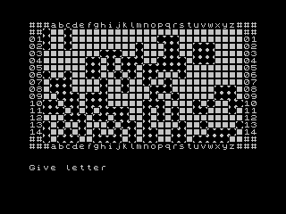

# Hampson's Plane

Hampson's Plane is a tile flipping game, written by Mike Hampson. A BASIC version of the game first appeared in a US computing magazine called SYNC magazine in the early 1980s.

Mike later ported the game to FORTH and included it as an example program for his Spectrum Forth compiler, which was published by CP Software in 1983. CP Software's Spectrum Forth was a quirky implementation of Forth, which missed some key features. However it was fast (according to the instructions, faster than other Spectrum Forth implementations and Jupiter Ace Forth).

This is a further port of the game to Ace Forth, which you can play on your Jupiter Ace or Minstrel 4th. I have tried to stay as close as possible to Mike's original Forth version, only changing things when I had to.

## Playing the game

The aim of the game is to flip tiles until all of them are face up (filled in). You flip tiles by specifying their coordinates. However, you flip a 3x3 square of tiles, though those immediately around the square you pick will also be flipped.



To load the game, enter:

```
load hampson
game
```

You will be asked to select a skill level from 1 to 9 and then a random starting grid will be created. Once this is finished, you will be asked for coordinates (column, followed by row) of the tile you wish to flip. For example, to select the tile at grid location c01, type `c`, `0`, and `0` (you must enter the row number as two digits).

If you complete the game, you will be returned to the Ace prompt.
