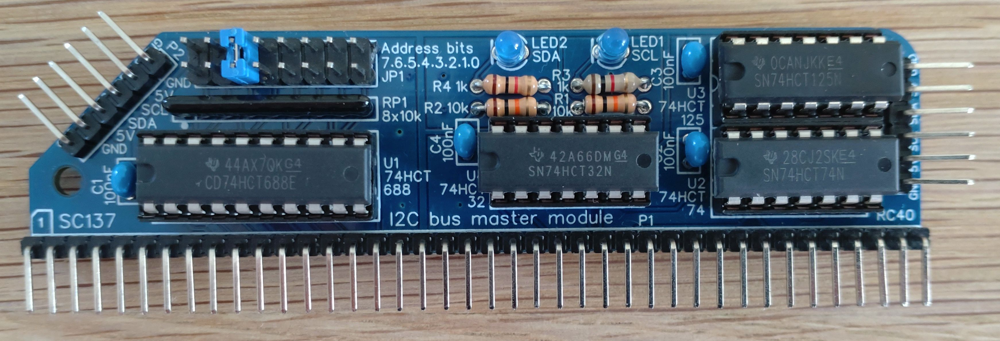

# An I2C Library for the Minstrel 4th

## Introduction

Inspired by a video on Tim's Retro corner (https://youtu.be/4sX05bnFuwc?si=C3DUPkzGvRP220mm), I have been experimenting with the I2C interface on the Minstrel 4th. Thanks to the RC2014 bus on the Minstrel 4th, there are various options for an I2C controller.

I am using the [Small Computer Central SC137](https://smallcomputercentral.com/rcbus/sc100-series/sc137-i2c-master-module-rc2014/) from Steve Cousins. The SC137 is an excellent kit, with through-hole components, very clear instructions and example code to get you started.



As a first I2C peripheral, I used a [Texas Instruments LM75A digital temperature sensor](https://www.ti.com/product/LM75A?utm_source=google&utm_medium=cpc&utm_campaign=ti-null-null-xref-cpc-pf-google-ww_en_cons&utm_content=xref&ds_k=LM75A&dcm=yes&gclsrc=aw.ds&gad_source=1&gad_campaignid=23167718368&gclid=Cj0KCQjw6_HSBhCpARIsANvVltbx4UwIXEwhoU4tSVX0ZtXN4xTsuBVeuN6lcSwTbR4VB1l1UBybTU0aAhjWEALw_wcB). Again, the LM75A is supported by good-quality documentation from Texas Instruments.

My aim has been to develop an I2C library in Forth for the Minstrel 4th to allow people to use different I2C peripherals and easily develop software for them. My library is heavily based on Steve Cousin's Z80 demonstrator plus this [I2C tutorial](https://www.robot-electronics.co.uk/i2c-tutorial) helped me get up to speed with the I2C protocol. Finally, I checked the low-level operations using the [I2C standard](https://www.nxp.com/docs/en/user-guide/UM10204.pdf), which is very readable and worth checking.

I have provided two versions of the I2C library: one for Ace Forth and one for the Minstrel 4th port of Tree Forth. Tree Forth has multi-tasking functionality which is very useful for running several I2C devices as part of a bigger project. However, I started with Ace Forth, as I find the editor in Ace Forth easier to use, making experimentation more efficient.

The current library includes all the usual I2C operations (init, open, read, write, and close) plus an example for reading from the LM75A temperature sensor. The library assumes you are using the SC137 interface in its default configuration (listening on port 0x20). However, the I/O port and the bits used for the clock line (SCL) and data transmission (SDA) can be changed by redefining the relevant constant (`I2C_PORT`, `SCLBIT`, and `SDABIT`, respectively). For example, to change the I/O port to 48d in Ace Forth:

```
  DECIMAL
  48 CONSTANT I2C_PORT
  REDEFINE I2C_PORT
```

---or, on Tree Forth:

```
  DECIMAL
  48 TO I2C_PORT
```

## Loading the I2C Library

For the Ace Forth version, I have provided a TAP file, which you could load with (for example) the Tynemouth Serial Card (`TAPIN I2C_INTERFACE.TAP LOAD I2C`). I have also included a WAV file which you could load via the cassette interface (`LOAD I2C`). Finally, I have included the source code ([i2c_interface.fs](i2c_interface.fs)), so you can study that. 

For the Tree Forth version, I have provided a WAV file in which the source code is contained in six screens. This will only work on the Minstrel 4th port of Tree Forth: if you wish to run on Minstrel 3 or ZX81, you will have to type in the source code (see below). To load the library into Tree Forth, switch to split-screen view and make the console active (using Shift-1). Then enter:
```
CON 1 LOAD
```
--and play the WAV file. A print-out of the source code is provided in [i2c_zxf4.bmp](i2c_zxf4.bmp), which has been made by listing each screen to the ZX Printer (emulated in EightyOne).

## Using the Library

There are three constants (integers on Tree Forth) that define how to interact with the I2C control interface:

- `I2C_PORT` - the I/O port which the I2C control interface is listening on (e.g., 0x20 for the SC137).

- `SCLBIT` - the bit mask to set the SCL to be high (e.g., %00000001 for the SC137).

- `SDABIT` - the bit mask to set the SDA to be high (e.g., %10000000 for the SC137).

These can be redefined according to the requirements of your interface and its configuration.

Once configured, the library should be fairly straightforward to use. There are four high-level words which should be sufficient for typical use cases.

- `I2C_OPEN ( NN -- FL )` is used to initiate communications with a target peripheral, putting the I2C bus into a busy state. On entry, TOS should contain an 8-bit address (the 7-bit device id plus the read/ write bit). On exit, the stack contains `0` if the operation is successful or `-1` otherwise.

- `I2C_WRITE ( NN -- FL )` is used to write a byte to a target peripheral, after successfully opening a conversation. The operation can accommodate clock stretching by the target peripheral. On entry, TOS contains the byte to send. On exit, the stack contains `0` if the operation is successful and acknowledged by the target, or `-1` otherwise.

- `I2C_READ ( FL -- NN )` is used to read a byte from a target peripheral, after successfully opening a conversation. On entry, the TOS indicates whether the read operation should be acknowledged (TOS = 1) or not acknowledged (TOS = 0).

- `I2C_CLOSE ( -- )` is used to end a conversation, freeing the bus.

These words are built up from various lower-level functions, which might sometimes be useful in their own right. Take a look at the source code for more information.

There are also a few helper words, which are not strictly required for an I2C bus, but which can be useful:

- `I2C_INIT ( -- )` will set the bus in the free state, with both SCL and SDA set to their quiescent levels. 

- `?SC137_CHK ( -- )` will check if the SC137 control device is present and responding. On exit, TOS is zero if device detected, or -1 otherwise.  You could update this word to support your own control device.

## Demonstration

The I2C library includes a simple demonstration to help you get started, based on the LM75A temperature sensor. Two words are provided: `LM_SETUP` and `LM_READ` which show how to initialise the sensor into comparator mode and how to read a 9-bit temperature measurement, respectively.

These routines follow the usual approach of: opening communications with the device (with `I2C_OPEN`), selecting a register by writing a register id onto the bus (with `I2C_WRITE`), either reading or updating the register's contents (with `I2C_READ` or ``I2C_WRITE`), and then closing the connection (with `I2C_STOP`). Note that once you have opened a dialogue with a device, you may issue multiple read and write instructions.

You can remove the demonstrator from the library (e.g., to save memory) by entering `FORGET LM75A_7BIT` and then adding your own code.

Enjoy!