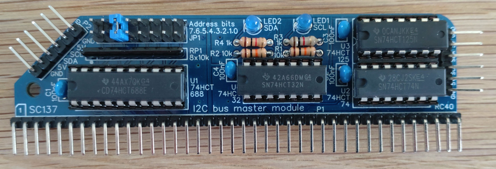
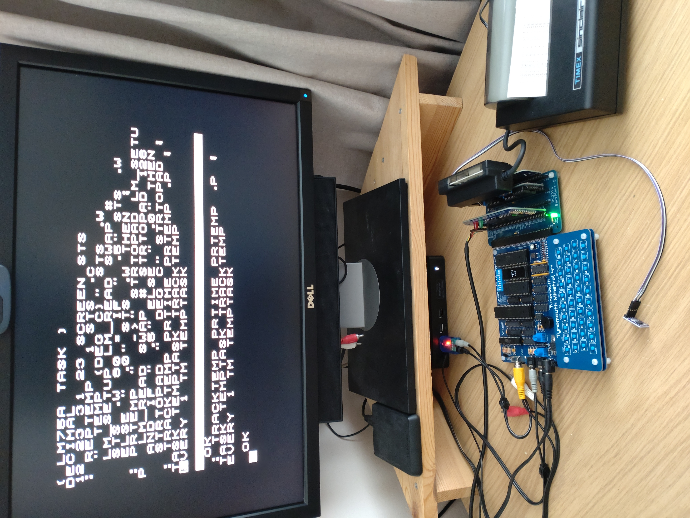

# An I2C Library for the Minstrel 4th

## Introduction

Inspired by a video on Tim's Retro Corner (https://youtu.be/4sX05bnFuwc?si=C3DUPkzGvRP220mm), I have been experimenting with the I2C interface on the Minstrel 4th.

Thanks to the RC2014 bus on the Minstrel 4th, there are various options for an I2C controller. I am using the [Small Computer Central SC137](https://smallcomputercentral.com/rcbus/sc100-series/sc137-i2c-master-module-rc2014/) from Steve Cousins. The SC137 is an excellent kit, with through-hole components, very clear instructions, and example (Z80) code to help you to get started.



I also needed an I2C peripheral and, aiming to keep things simple, I selected a [Texas Instruments LM75A digital temperature sensor](https://www.ti.com/product/LM75A?utm_source=google&utm_medium=cpc&utm_campaign=ti-null-null-xref-cpc-pf-google-ww_en_cons&utm_content=xref&ds_k=LM75A&dcm=yes&gclsrc=aw.ds&gad_source=1&gad_campaignid=23167718368&gclid=Cj0KCQjw6_HSBhCpARIsANvVltbx4UwIXEwhoU4tSVX0ZtXN4xTsuBVeuN6lcSwTbR4VB1l1UBybTU0aAhjWEALw_wcB). Again, the LM75A is supported by good-quality documentation from Texas Instruments.

My aim has been to develop an I2C library in Forth for the Minstrel 4th to allow people to connect a range of I2C peripherals and easily develop software for them. My library is heavily based on Steve Cousin's demonstrator code. Also, this [I2C tutorial](https://www.robot-electronics.co.uk/i2c-tutorial) helped me get up to speed with the I2C protocol. Finally, I checked the low-level operations using the [I2C standard](https://www.nxp.com/docs/en/user-guide/UM10204.pdf), which is very readable and worth checking.

I have provided two versions of the I2C library: one for Ace Forth and one for the [Minstrel 4th port of Tree Forth](https://github.com/markgbeckett/zx81/tree/main/zx-forth). Tree Forth has multi-tasking functionality which is very useful for controlling several I2C devices as part of a bigger project. However, I started with Ace Forth, as I find the Ace Forth monitor easier to use and more forgiving, making experimentation more efficient.

The current library includes all the usual I2C operations (init, open, read, write, and close) plus an example for reading from the LM75A temperature sensor. The library assumes you are using the SC137 interface in its default configuration (that is, listening on port 0x20). However, the I/O port and the bits used for the clock line (SCL) and data transmission (SDA) can be changed by redefining the  constant `I2C_PORT`, `SCLBIT`, and `SDABIT`, respectively. For example, to change the I/O port to 48d in Ace Forth:

```
  DECIMAL
  48 CONSTANT I2C_PORT
  REDEFINE I2C_PORT
```

---or, in Tree Forth:

```
  DECIMAL
  48 TO I2C_PORT
```

## Loading the I2C Library

For the Ace Forth version, I have provided a TAP file, which you could load with (for example) the Tynemouth Serial Card (`TAPIN I2C_INTERFACE.TAP LOAD I2C`). I have also included a WAV file which you could load via the cassette interface (`LOAD I2C`). Finally, I have included the source code ([i2c_interface.fs](i2c_interface.fs)), so you can study that. You could also load the library into [the EightyOne emulator](https://sourceforge.net/projects/eightyone-sinclair-emulator/), which could be a useful environment to develop support for new peripherals. However, EightyOne does not emulate any I2C device support, so testing has to be done on real hardware.

For the Tree Forth version, I have provided a [WAV file](i2c_zxf4.wav) in which the source code is spread across six screens. This will only work on the Minstrel 4th port of Tree Forth: if you wish to run on a Minstrel 3 or ZX81, you will have to type in the source code (see below). To load the library into Tree Forth, switch to the split-screen view and make the console active (using Shift-1). Then enter:
```
CON 1 LOAD
```
--and play the WAV file. The `CON` word enables automatic compilation when a screen is loaded, plus each screen is terminated with the `-->` word, so will automatically try to load the next screen. A print-out of the source code is provided in [i2c_interface_zxf4.fs](i2c_interface_zxf4.fs), which was captured from my Minstrel 4th using the [Tynemouth Software Serial interface](http://blog.tynemouthsoftware.co.uk/2025/11/software-serial-card-for-minstrel-4th-and-rc2014.html) and the `SLIST` word from [serial_zxf4.fs](../utilities/serial_zxf4.fs).

## Using the Library

There are three constants (integers in Tree Forth) that define how to interact with the I2C control interface:

- `I2C_PORT` - the I/O port which the I2C control interface is listening on (e.g., 0x20 for the SC137).

- `SCLBIT` - the bit mask to set the SCL to be high (e.g., %00000001 for the SC137).

- `SDABIT` - the bit mask to set the SDA to be high (e.g., %10000000 for the SC137).

These can be redefined according to the requirements of your interface and its configuration.

Once configured, the library should be fairly straightforward to use. There are four high-level words which should be sufficient for typical use cases.

- `I2C_OPEN ( NN -- FL )` is used to initiate communications with a target peripheral, putting the I2C bus into a busy state. On entry, TOS should contain an 8-bit address (the 7-bit device id plus the read/ write bit). On exit, the stack contains `0` if the operation is successful or `-1` otherwise.

- `I2C_WRITE ( NN -- FL )` is used to write a byte to a target peripheral (assumes a conversation has been initiated with `I2C_OPEN`). The operation can accommodate clock stretching by the target peripheral. On entry, TOS contains the byte to send. On exit, the stack contains `0` if the operation is successful and acknowledged by the target, or `-1` otherwise.

- `I2C_READ ( FL -- NN )` is used to read a byte from a target peripheral (assumes a conversation has been initiated with `I2C_OPEN`). On entry, the TOS indicates whether the read operation should be acknowledged (TOS = 1) or not acknowledged (TOS = 0).

- `I2C_CLOSE ( -- )` is used to end a conversation, freeing the bus.

These words are built up from various lower-level functions, which might sometimes be useful in their own right. Take a look at the source code for more information.

There are also a few helper words, which are not strictly required for an I2C bus, but which can be useful:

- `I2C_INIT ( -- )` will set the bus in the free state, with both SCL and SDA set to their quiescent levels.

- `?SC137_CHK ( -- FL )` will check if the SC137 control device is present and responding. On exit, TOS is zero if device detected, or -1 otherwise.  You could update this word to support your own control device.

## Demonstration

The I2C library includes a simple demonstration to help you get started, based on the LM75A temperature sensor. Two words are provided: `LM_SETUP` and `LM_READ` which show how to initialise the sensor into comparator mode and how to read a 9-bit temperature measurement, respectively.




These routines follow the usual approach of: opening communications with the device (with `I2C_OPEN`), selecting a register by writing a register id onto the bus (with `I2C_WRITE`), either reading or updating the register's contents (with `I2C_READ` or `I2C_WRITE`), and then closing the connection (with `I2C_STOP`). Note that once you have opened a dialogue with a device, you may issue multiple read and write instructions.

You can remove the demonstrator from the library (e.g., to free up memory) by entering `FORGET LM75A_7BIT` and then adding your own code.

Enjoy!

## LCD Interface

As a second project, I decided to try to connect up and use a small liquid-crystal display. For example, as the SC137 interface supports two I2C devices, I could write a program to display the temperature read on the LM75A onto the LCD display and run that as a background task on Tree Forth.

Thanks to the Arduino community, there are lots of inexpensive, liquid crystal displays with I2C interfaces available online. These generally seem to be based on the [Hitach HD44780 display](https://www.crystalfontz.com/controllers/uploaded/HD44780_July_1985_Advance_Copy_Datasheet.pdf?srsltid=AU7gw4VJmNuVdoOuc3iCEpBIoVZzyaWg1JgrznKIZWecxi9czdSR_Fd9) (or a clone if it), connected to a [Texas Instument PCF8474](https://www.ti.com/lit/ds/symlink/pcf8574.pdf). The PCF8574 provides the I2C interface, serialising the messages to/ from the native parallel interface. The HD44780 has 12 significant signals (including eight data lines). However, as the display is designed to support both 4-bit and 8-bit microprocessors, it can be configured to work with the 8-bit signal supported by the I2C interface (that ism four data lines and four control signals).

Also, thanks to the Arduino community, a lot of the information online assumes you are using an Arduino and off-the-shelf software written for it. As I am planning to use Forth to control the display, I needed to delve a little deeper to find the information I needed.

The first thing to note is that, depending on your chosen supplier, it may not be obvious what model of LCD and I2C interface you have. Mine (bought from an Amazon-based Arduino supplier) certainly has no visible branding or model information. However, based on this document from [Handson Technology](https://handsontec.com/dataspecs/module/I2C_1602_LCD.pdf), I am reasonably confident that most of these devices will be based on the Hitachi display and the Texas Instruments interface. Further, the I2C interface is likely to be addressable with id 0x27 or 0x3F.

The Hitachi and Texas Instruments datasheet provide a lot of useful information, but they do not tell you how the two devices are interfaced together. It may be possible to infer this by studying the device connections. However, I consulted Dave Curran of Tynemouth Software and, based on that, determined the likely configuration; which was: I2C data bits 4--7 are mapped to bits 4--7 of the display's database (these are the pins that are used when the display is configured for four-bit communications). Then, bit 0 of the I2C interface is mapped to the Register Select line of the display, bit 1 to the Read/ Write line, bit 2 to the Enable pin, and bit 3 to the display backlight. The assigments is summarised below:
```
+----------------+--------------------+
| I2C signal     | LCD display signal |
|----------------+--------------------+
| Bit 0	       	 | Register Select    |
| Bit 1          | Read/ write        |
| Bit 2	         | Enable line        |
| Bit 3	         | Backlight          |
| Bit 4	         | D4                 |
| Bit 5	         | D5                 |
| Bit 6	         | D6                 |
| Bit 7	         | D7                 |
+----------------+--------------------+
```
The next thing to note is that, when powered on, the display defaults to eight-bit mode and, to switch to 4-bit mode, you need to run through a software-based reset sequence, as described on page 129 of the Hitachi document linked from above.

Based on this information, I have written a simple Forth library (currently, only in Ace Forth) to allow you to control such a display from your Minstrel 4th.

The library uses the base I2C library to communicate with the display and uses the following constants to address the I2C interface:

- `DISP_7BIT` -- the id of your I2C interface (default is 0x27, though might also be 0x3F).

- `DISP_ADDR` -- the base (that is, write) address of the I2C interface (which is derived from the device id).

If your I2C device is configured for a different address (e.g., 0x3F) you should first redefine the relevant constants, as follows:

```
DECIMAL 16 BASE C!
3F CONSTANT DISP_7BIT
REDEFINE DISP_7BIT
DISP_7BIT 2 * CONSTANT DISP_ADDR
REDEFINE DISP_ADDR
```

Having configured the library for your device, the following Forth words can be used to control the display:

- `LCD_INIT ( -- )` - initialise the display into 4-bit mode. This command needs to be run first, before any other interactions with the display.

- `LCD_PRINT ( ADDR -- )` - display the counted string stored in memory at `ADDR` onto the display. There is a sample message included in the library, which can be displayed using `MSG_GREETING LCD_PRINT`.

- `LCD_CLS ( -- )` - to clear the display and move cursor to home position (top, left character cell).

- `LCD_HOME ( -- )` - to move cursor to home position (top, left character cell).

- `LCD_SET_CURSOR ( COL ROW -- )` - to set the cursor position for subsequent text (indexed from zero). For example, to move cursor to the start of the second row, enter `0 1 LCD_CURSOR_SET`.

- `LCD_BL_OFF ( -- )` - to turn the backlight off.

- `LCD_BL_ON ( -- )` - to turn the backlight on.

The LCD support is currently very rudimentary. There is no validation of inputs nor does the code do fundamental checking -- e.g., if a display is even present. There are other words in the dictionary, not documented here, as they are currently not working as I had expected and I am continuing to investigate the display's interface.


