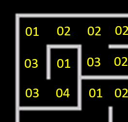

# A-Mouz-in-Mase

## Background

In May 2021, the curator of the [Jupiter Ace Archive](https://www.jupiter-ace.co.uk/) posted a [message on Twitter](https://twitter.com/JA_Archive/status/1399479238328295424), asking for help to recover one of a small number of games that he had recently found on a cassette. The game in question was known simply as MAZE and, as the name suggests, was supposed to be some kind of maze game. Two versions were available: the program as extracted from the cassette, which had various corruption; and a partially recovered version, in which all but a word named SCAN seemed to be okay.

I decided to have a go at recovering the game, and to see if I could find out more about it.

I downloaded both versions, though was initially unable to load the part-recovered version, so started from the original.

The good news was that the original _rip_ of the cassette loaded and could be run. It opened with a screen of instructions (which also confirmed the game name to be _A-Mouz-in-Mase_ (sic.), before asking you to choose a maze size, and then starting to build a maze. Unfortunately, shortly after starting the maze-build, the program crashed, resetting the Ace.


The source code had no information on the origins of the game: who wrote it, who published it, and when it was written. I still have not found any of this information, so would be happy to hear from anyone who knows more.

As I explain below, I have now been able to recover the program so it can be enjoyed once again. During the recovery, I had to rewrite some of the code, so it is not quite the original game, though I have tried to use a light touch and to keep as much of the original code as I could.

The game can be played on either an emulator or real hardware (a Jupiter Ace with a 32kb RAM pack, or a Minstrel 4th). Open the TAP or WAV file, as appropriate, power up your Ace and type:

```
LOAD MAZE
```

The program loads in around one minute. Once loaded, type ```RUN``` to start the program.

After displaying some brief instructions, you are asked to choose a maze size. Note that the small and medium maze can be created on a 16kb machine, but you will need at least 32kb to build the large maze.

Having chosen the maze size, you will see the computer create a maze at random, in realtime. The small maze fits on one screen and takes around a minute to produce. The medium maze fits on 2-by-2 screens and takes around four minutes. The large maze is 3-by-3 screens and takes around eight to ten minutes to produce.

Once the maze is generated, you are asked if you wish to Play or Watch the maze. Selecting Play will position your mouse at the entrance to the maze and let you work out the path to the exit, yourself, using the slightly awkward key combination of A, Z, K, and M.

Selecting Watch will cause the computer to solve the maze for you, tracing both the correct path and failed paths as it goes.

Once the maze is solved, you return immediately to the menu from which you can choose the next maze size.

## Recovery Process

This section is best read in conjunction with the [source code](maze.fs).

The game is encapsulated in a top-level word called RUN, which runs through the following steps, each time the game is played:

1. Print instructions
2. Ask user to choose maze size
3. Generate maze
4. Solve maze automatically or let user solve maze

I decided to work through each stage, in turn, attempting to repair any corrupted code and restore the intended functionality.

### Maze Generation

Steps 1 and 2 are very straightforward, with little corruption, so I quickly moved to tackle the maze-generation code. The first part of the setup is a word called CLEAR, which sets up an empty maze in memory, ready to be generated. As mentioned above, the game supports three maze sizes, made up of 1-by-1 (small), 2-by-2 (medium), or 3-by-3 (large) maze _sections_, with each maze section being 31-by-20 cells in size. Although each section is 31-by-20 in size, it is held in a 32-by-21-byte section of memory, to accommodate the righthand and bottom boundaries, which are outside of the maze (as will be explained later).

The maze information is held in two data structures. One structure holds the screen contents for each section of the maze, so it can be rapidly displayed (by copying it into the screen memory). The other structure stores the connectivity of the maze, again in sections, along with some state information used during maze generation and when automatically solving the maze. The maze state is based on bit logic, with the following roles assigned to individual bits:

* Bit 0 -- set, if can move right from cell, reset otherwise
* Bit 1 -- set, if can move left from cell, reset otherwise
* Bit 2 -- set, if can move up from cell, reset otherwise
* Bit 3 -- set, if can move down from cell, reset otherwise
* Bit 4 -- set, if already visited when auto-solving maze
* Bit 5 -- apparently, not used
* Bit 6 -- set, to indicate maze exit
* Bit 7 -- set, if already visited during maze generation.

I noted that Bits 5 is apparently not used, as it is an ideal candidates to work around one of the corruptions I discovered in the game.

The screen sections contain 32x21 arrays of bytes, containing character values between 1 and 12. These are user-defined graphics set up with the word GR, when the instructions are printed. The 12 characters represent three sets of four maze-wall configurations. Characters 1, 2, 3, and 4 contain graphics for walls on top and left, a wall on top, a wall on the left, and a top-left corner only, respectively. To box in a particular cell: the actual cell needs to have top and left walls; the cell immediately to the right needs to have, at least, the left wall set; the cell immediately below needs to have, at least, the top wall set; and the cell down and to the right needs to have at least the top-left corner set. This is why it takes 32x21 characters to store a 31x20 maze: the final column contains mostly 3s, the final row contains mostly 2s, and the bottom-right corner contains 4.

If that seems confusing take a look at an example screenshots of a maze section. This section shows the top-left 4x3 section of a maze, with the corresponding character codes in yellow. The top left cell has both the top and left wall filled in, so is represented by character 1. The cell to the right of that has just the top wall filled in so is represented by a 2 (remember the bottom wall comes from the cell below). The first cell on the second row has a left wall and right, so will be represented by character 3 with character 1 to the right of it (to fill in the right wall) and so on. Hopefully that makes sense though, if not, draw your own version of this maze segment by filling in the walls that correspond to each character.



Characters 5,...8 and characters 9,...,12 contain the same wall sections, but also have either a large square or a small square in the middle of the cell. These are used to indicate: the current location; a cell on the solution; or a cell that has been visited but discounted from the solution.

Look at the completed maze puzzle (it is actually the zoom-out of the maze we looked at before) and see how the correct path is highlighted with large squares whereas wrong turns that needed to be backtracked are shown with small squares. The entrance to the maze is near the top-right corner and the exit is near the bottom-left corner. On this occasion, the mouse explored almost the whole maze before finding the solution: there is a small part of the maze immediately to the right of the exit which was not explored.


By organising the user-defined graphics in this way, you can mark a step on the path of the mouse by adding four to the current value at a location, and then mark a path that is backtracked by adding a further four to the value. This will become clearer when we describe how the automatic solver works later.

The two data structures are stored in free memory, starting a little above the end of the dictionary, to allow space for the stack to grow. The memory is unmanaged: no checks are made that there is enough space. If there is insufficient memory, the computer will crash during setup (most likely, because the data will overwrite the return stack). For example, if you have a 16-kilobyte RAM expansion and try to create a 'large' maze, the machine will crash.

The location of the start of the maze-state information is fixed, at 30 bytes past the end of the dictionary. In the source code, you will often see the calculation ``HERE 30 +`` used to find this location. For the 'medium' and 'large' maze, the state is stored in a series of 32x21 sections. The variables U and V record which maze section is current, indexed from 1 (confusingly, column and row, respectively). The meaning of current is dependent on which part of the game is active, though generally it is the section where the action is taking place (e.g., in which the mouse is located, when solving the maze). Also, the variable W stores the address of the start of that section in the maze-state information.

The value of W could be worked out using the following Forth snippet (noting that the variable Z holds the size specified by the user in Step 2):

```
 ...
  HERE 30 + ( WORK OUT START OF MAZE-STATE DATA STRUCTURE )
  V @ 1- ( RETRIEVE ROW NUMBER AND NORMALISE TO ZERO )
  Z @ ( RETRIEVE MAZE SIZE: 1 - SMALL; 2 - MEDIUM; 3 - LARGE )
  672 * * + ( ADD ON Z*(V-1) SCREEN SECTIONS )
  U @ 1- ( RETRIEVE COLUMN NUMBER AND NORMALISE TO ZERO )
  672 * + ( ADD (U-1) SCREEN SECTIONS TO THE ADDRESS )
  ...
```

Note that 672 is 32x21 which is the number of bytes in a screen section.

The screen-display information is stored immediately above the maze-state information, with the same arrangement of maze sections as for the maze-state information. The beginning of the screen-display information is recorded in variable 'P1' and the start of the current screen-display section is stored in variable 'P'.

Once the two maze-related data structures are initialised, a maze is generated in the word ``DRAW``. It starts by randomly choosing a location for the maze entrance (in word ``DOOR``). DOOR will initialise a variable 'OX' to contain the opposite side of the maze fom the entrance, which is where the exit will be located.

Having determined the start point, the maze is generated using a version of the depth-first algorithm encoded in the word ``PATH``.

In the original program, ``PATH`` was the point at which the program crashed. Specifically, the word ``MOVE`` -- which is called repeatedly in ``PATH`` to expand the maze by one cell until it is completed -- was the point at which the program crashes.


## Status and Possible Improvements

The program has now been recovered and, to the best of my knowledge, works are the author intended. I have anotated the [source code](maze.fs) for anyone who is interested to delve into the working of the game.

Studying the code has highlighted a few potential improvements, for future work:

* The game tends to produce the same mazes each time, as the random-number seed is initialised to a constant value. This could be easily addressed by, for example, initialising the seed using the low work of the internal clock.
* When the auto-solver completes, the game immediately returns to the main menu, which means you do not get a chance to study the solution. There is a loop in the code, which looks like a wait loop, though the duration of the wait is very short and could be extended.
* The game does not check availability of memory, but just assumes there is enough space between the end of the dictionary and the start of the return stack. With a 16 kilobyte RAM pack (that is, 19kb of RAM), there is not enough spare memory for the largest maze size. Attempting to generate the largest maze will cause the computer to crash.
* The game holds two copies of the maze in memory (along with the active maze segment in the display area). For the largest maze, this requires 2*3*3*32*21 = 12,096 bytes. It should be possible to reduce this by half, investing more time into displaying the active maze segment. However, this would slow-down redrawing the on-screen maze segment, though this might be okay, and could enable even bigger mazes to be supported.
