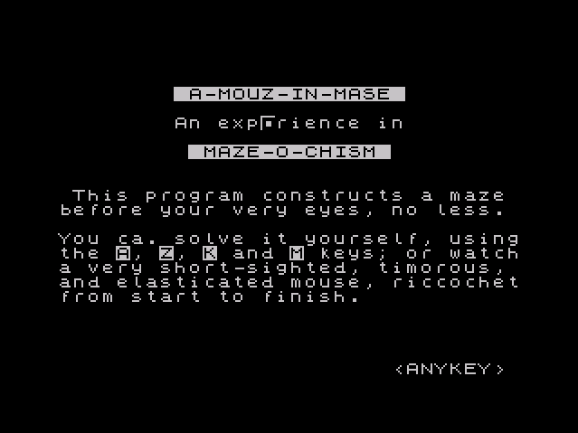

# A-Mouz-in-Mase

## Background

In May 2021, the curator of the [Jupiter Ace Archive](https://www.jupiter-ace.co.uk/) posted a [message on Twitter](https://twitter.com/JA_Archive/status/1399479238328295424), asking for help to recover one of a small number of games that he had recently found on a cassette. The game in question was known simply as MAZE and, as the name suggests, was supposed to be some kind of maze game. Two versions were available: the program as extracted from the cassette, which had various corruption; and a partially recovered version, in which all but a word named SCAN seemed to be okay.

I decided to have a go at recovering the game, and to see if I could find out more about it.

I downloaded both versions, though was initially unable to load the part-recovered version, so started from the original.

The good news was that the original _rip_ of the cassette loaded and could be run. It opened with a screen of instructions (which also confirmed the game name to be _A-Mouz-in-Mase_ (sic.), before asking you to choose a maze size, and then starting to build a maze. Unfortunately, shortly after starting the maze-build, the program crashed, resetting the Ace.



The source code had no information on the origins of the game: who wrote it, who published it, and when it was written. I still have not found any of this information, so would be happy to hear from anyone who knows more.

As I explain below, I have now been able to recover the program so it can be enjoyed once again. During the recovery, I had to rewrite some of the code, so it is not quite the original game, though I have tried to use a light touch and to keep as much of the original code as I could. Thankfully, I was able to read the part-recovered version, by using a different emulator ([XAce](http://lawrencewoodman.github.io/xAce/) for Linux), which saved some time for the recovery process.

The game can be played on either an emulator (such as [EightyOne](https://sourceforge.net/projects/eightyone-sinclair-emulator/) or XAce) or on real hardware (a Jupiter Ace with a 32kb RAM pack or a Minstrel 4th). Open the TAP or WAV file, as appropriate, power up your computer and type:

```
LOAD MAZE
```

The program loads in around one minute. Once loaded, type ```RUN``` to start the program.

After displaying some brief instructions, you are asked to choose a maze size. Note that the small and medium maze can be created on a 16-kilobyte machine, but you will need at least 32 kilobytes of memory to build the large maze.

Having chosen the maze size, you will see the computer create a maze at random, in realtime. The small maze fits on one screen and takes around a minute to produce. The medium maze fits on 2-by-2 screens and takes around four minutes. The large maze is 3-by-3 screens and takes around eight to ten minutes to produce.

Once the maze is generated, you are asked if you wish to Play or Watch the maze. Selecting Play will position your _mouse_ at the entrance to the maze and let you work out the path to the exit, yourself, using the slightly awkward key combination of A, Z, K, and M.

Selecting Watch will cause the computer to solve the maze for you, tracing both the correct path and any failed turns it takes on the way.

Once the maze is solved, you return immediately to the menu from which you can choose to generate and solve another maze.

## Recovery Process

This section is best read in conjunction with the [source code](maze.fs) to which I have added lots of comments. The source code is taken directly from a Minstrel 4th, using a serial interface, so should be error-free.

The game is encapsulated in a top-level word called RUN, which runs through the following steps, each time the game is played:

1. Print instructions
2. Ask user to choose maze size
3. Generate maze
4. Solve maze automatically or let user solve maze

I decided to work through each stage, in turn, attempting to repair any corrupted code and restore the intended functionality as I went.

### Maze Generation

Steps 1 and 2 are very straightforward, with little corruption, so I quickly moved to tackle the maze-generation code. The first part of the setup is a word called CLEAR, which sets up an empty maze in memory, ready to be generated. As mentioned above, the game supports three maze sizes, made up of 1-by-1 (small), 2-by-2 (medium), or 3-by-3 (large) maze _sections_, with each maze section being 31-by-20 cells in size. Although each section is 31-by-20 in size, it is held in a 32-by-21-byte section of memory, to accommodate the righthand and bottom boundaries, which are outside of the maze (as will be explained later).

The maze information is held in two data structures. One structure holds the screen contents for each section of the maze, so it can be quickly displayed (by copying it into the screen memory). The other structure stores the connectivity of the maze, again in sections, along with some state information used during maze generation and when automatically solving the maze. The maze connectivity and state is based on bit logic, with the following roles assigned to individual bits:

* Bit 0 -- set, if can move right from cell, reset otherwise
* Bit 1 -- set, if can move left from cell, reset otherwise
* Bit 2 -- set, if can move up from cell, reset otherwise
* Bit 3 -- set, if can move down from cell, reset otherwise
* Bit 4 -- set, if already visited when auto-solving maze
* Bit 5 -- apparently, not used
* Bit 6 -- set, to indicate maze exit, reset otherwise
* Bit 7 -- set, if already visited during maze generation

I noted that Bits 5 is apparently not used, as it is an ideal candidates to work around one of the corruptions I discovered in the game.

The screen sections contain arrays of 32x21 bytes, containing character values between 1 and 12. These correspond to user-defined graphics set up with the word GR, when the instructions are printed. The 12 characters represent three sets of four maze-wall configurations. Characters 1, 2, 3, and 4 contain graphics for walls on top and left, a wall on top, a wall on the left, and a top-left corner only, respectively. To box in a particular cell: the actual cell needs to have top and left walls; the cell immediately to the right needs to have, at least, the left wall set; the cell immediately below needs to have, at least, the top wall set; and the cell down and to the right needs to have at least the top-left corner set. This is why it takes 32x21 characters to store a 31x20 maze: the final column contains mostly 3s, the final row contains mostly 2s, and the bottom-right corner contains 4.

The maze is initialised with all walls in place. It looks like an array of squares. Most cells in the screen array contain character 1 (except for the right-most column and bottom row of each maze section, as noted above). 

If that seems confusing take a look at an example screenshots of a maze section. This section shows the top-left 4x3 section of a maze, with the corresponding character codes in yellow. The top left cell has both the top and left wall filled in, so is represented by character 1. The cell to the right of that has just the top wall filled in so is represented by a 2 (remember the bottom wall comes from the cell below). The first cell on the second row has a left wall and right, so will be represented by character 3 with character 1 to the right of it (to fill in the right wall) and so on. Hopefully that makes sense though, if not, draw your own version of this maze segment by filling in the walls that correspond to each character.


Characters 5,..,8 and characters 9,...,12 contain the same wall sections, but also have either a large square or a small square in the middle of the cell. These are used to indicate: the current location; a cell on the solution; or a cell that has been visited but discounted from the solution.

Look at the completed maze puzzle (it is actually the zoom-out of the maze we looked at before) and see how the correct path is highlighted with large squares whereas wrong turns that needed to be backtracked are shown with small squares. The entrance to the maze is near the top-right corner and the exit is near the bottom-left corner. On this occasion, the mouse explored almost the whole maze before finding the solution: there is a small part of the maze immediately to the right of the exit which was not explored, plus several other short path sections.


By organising the user-defined graphics in this way, you can mark a step on the path of the mouse by adding four to the current value at a location in the screen data, and then mark a path that is backtracked by adding a further four to the value. This will become clearer when we describe how the automatic solver works later.

The two data structures are stored in free memory, starting a little above the end of the dictionary, to allow space for the stack to grow. The memory is unmanaged: no checks are made that there is enough space. If there is insufficient memory, the computer will crash during setup (most likely, because the data will overwrite the return stack). For example, if you have a 16-kilobyte RAM expansion and try to create a 'large' maze, the machine will crash.

The location of the start of the maze-state information is fixed, at 30 bytes past the end of the dictionary. In the source code, you will often see the calculation ``HERE 30 +`` used to find this location. For the 'medium' and 'large' mazes, the state is stored in a series of 32x21 sections. The variables U and V record which maze section is _current_, indexed from 1 (confusingly, column and row, respectively). The meaning of current is dependent on which part of the game is active, though generally it is the section where the action is taking place (e.g., in which the mouse is located, when solving the maze). Also, the variable W stores the address of the start of that section in the maze-state information.

The value of W could be worked out using the following Forth snippet (noting that the variable Z holds the size specified by the user in Step 2):

```
 ...
  HERE 30 + ( WORK OUT START OF MAZE-STATE DATA STRUCTURE )
  V @ 1- ( RETRIEVE ROW NUMBER AND NORMALISE TO ZERO )
  Z @ ( RETRIEVE MAZE SIZE: 1 - SMALL; 2 - MEDIUM; 3 - LARGE )
  672 * * + ( ADD ON Z*(V-1) SCREEN SECTIONS )
  U @ 1- ( RETRIEVE COLUMN NUMBER AND NORMALISE TO ZERO )
  672 * + ( ADD (U-1) SCREEN SECTIONS TO THE ADDRESS )
  ...
```

Note that 672 is 32x21 which is the number of bytes in a maze section.

The screen-display information is stored immediately above the maze-state information, with the same arrangement of maze sections as for the maze-state information. The beginning of the screen-display information is recorded in variable 'P1' and the start of the current screen-display section is stored in variable 'P'.

Once the two maze-related data structures are initialised, a maze is generated in the word ``DRAW``. It starts by randomly choosing a location for the maze entrance (in word ``DOOR``, which also initialises a variable 'OX' to contain the opposite side of the maze from the entrance, which is where the exit will be located).

Having determined the start point, the maze is generated using a version of the depth-first algorithm encoded in the word ``PATH``.

In the original program, ``PATH`` was the point at which the program crashed. Specifically, the word ``MOVE`` -- which is called repeatedly in ``PATH`` to expand the maze by one cell at a time until it is completed -- was the point at which the program crashes.

The depth-first algorithm is explained nicely on [Wikipedia](https://en.wikipedia.org/wiki/Maze_generation_algorithm). MOVE expands the maze by one cell each time it is called. It starts from the most recently explored cell and attempts to grow the maze in one of the four possible directions, randomly chosen from a vector of possible directions pointed to by the variable 'D'.

If the choice of next cell is already populated (indicated by bit 7 being set in the corresponding entry of the maze-status structure), then the computer will try another direction until it has exhausted all four possible directions, at which point it determines it has reached a dead end and needs to backtrack.

In the original corrupted version of the program, the backtrack routine (encoded in a word named SCAN) seemed hopelessly corrupted. It contained what looked like interleaved segments of the MOVE routine, with lots of corruption. Worse still, I could not work out how backtracking could possibly work, as there did not seem to be any record of the path the generation program had taken.

The usual approach to backtracking is to create a stack of previous moves and then pop moves off of the stack one by one until you get back to a cell from which you can continue to grow the maze. However, in MAZE, there was no evidence of the use of a stack for this (even though this is FORTH!). Further, such a stack could potentially be as long as the maze is large, meaning it would take a significant amount of memory in its own right. However, the programmer had remembered the path taken, it appears to have been lost.

Given the situation, I decided to try to implement my own backtracking program and, to save memory, I recorded the generation path in the maze-status structure.

Fortunately, there are (during generation) two unused bits in the maze-state for each cell. Bit 4, which is not used until later in the program, when solving the maze, and Bit 5, which is not used at all. These two bits are enough to record from which direction the maze-generation code entered a cell.

For example, if MOVE expands the maze one cell to the right, then in the new cell, I record that the generator came from the left. Then, if the new cell turns out to be a dead-end, the program determine from which direction the generator came and backtrack (to the left).

To implement this approach, I needed to completely rewrite the SCAN routine, as well as to update the four words that grow the maze (named 'X+', 'X-', 'Y+', 'Y-', for right, left, down, and up, respectively) to record the backtracking information.

Once the maze had been generated, I also needed to reset Bit 4 of every cell in the maze-status structure, so it could be used for later solving the maze. This is done in a new word called CLEARTRAIL.

With the new SCAN routine and other modifications noted above (plus some other small corrections to remove corruption from the code) the program successfully generated a small maze (with size '1'), though crashed for larger maze sizes.


Further investigation into the program identified some corruption within the code that switched from one maze section to another, when the maze generation moves between sections. With this corruption fixed, it was possible to generate all of the three maze sizes.

Once a maze has been created, the player has two options. They can either try to solve the maze themselves, or get the computer to solve it for them. 

The code used to solve the maze by hand is straightforward. A loop reads the keyboard and then tries to move in the requested direction. If the move takes the player to the exit, then the game ends.

The code to solve the maze automatically is quite involved and saves memory by recording progress within the maze-status structure. This does have the disadvantage of corrupting the maze, so once it has been solved, a new maze needs to be generated before it can be played again.

The word used to automatically solve the maze is named ``AUTO``. It starts by retrieving the location on the entrance (held in the variables 'IX', 'IU' and 'IV') and then works step-by-step to explore the maze until reaching the exit.

Each cell that is visited is marked as visited by setting Bit 4 of the corresponding entry in the maze-status structure. At each step the computer tries to move in the four possible directions, one at a time. It starts by trying to move right, then left, then up and finally down.

If it can move in a direction, then it checks to see if the cell in that direction has been visited before. If it has, then it checks if any other directions are possible. If other directions are possible it tries them. However, if not, then the computer knows it has reached a deadend. Even though the cell has been visited, it backtracks to that cell, and then modifies the maze-status structure to close of the path from which it has come.

To illustrate, look at the screenshot below, which is taken mid-way through the computer trying to solve a maze. Several cells have been highlighted. The yellow circle identifies the current location and you can see that the computer has reached a dead-end. On the next move, the computer will identify that it can move up though, when it does, it will discover the cell has already been visited. As there are no other directions available from the current location, the computer knows it has reached a deadend, so it will replace the marker at the current cell by a small square, moves up to the cell above, but then modifies the maze-status structure to block off the current location, so that it will not follow this path again. It will continue to backtrack until it reaches the cell highlighted in blue, when it will be able to explore (at least, for a couple of moves) a new part of the maze by going down.

Although the maze-status structure is modified to block off deadends, the display version is not, so you do not see the invisible walls that have been added to eliminate wrong turns.

In this way, the computer reduces the maze down to just the path that connects the entrance to the exit and, because of the way the maze has been created, the computer will always find a solution in this way.


## Status and Possible Improvements

The program has now been recovered and, to the best of my knowledge, works as the author intended. I have annotated the [source code](maze.fs) for anyone who is interested to delve into the workings of the game.

Studying the code has highlighted a few potential improvements:

* The game tends to produce the same mazes each time, as the random-number seed is initialised to a constant value. This could be easily addressed by, for example, initialising the seed using the low word of the internal clock. This is described in Steven Vickers book 'FORTH Programming' (page 82--83), which looks to be from where the author obtained the random-number generator.
* When the auto-solver completes, the game immediately returns to the main menu, which means you do not get a chance to study the solution. There is a loop in the code, which looks like a wait loop, though the duration of the wait is very short and could be extended. 
* Better still, for the medium and large mazes, it would be useful to be able to move between the maze sections to see the full solution. There is an unused word ``SP``, which displays each maze section in turn, and could be used to allow the player to review the solution at the end of the game. Perhaps this was intended for the original game.
* The game does not check there is enough memory to hold the user's selected maze size, but just assumes there is enough space between the end of the dictionary and the start of the return stack. With a 16-kilobyte RAM pack (that is, 19kb of RAM), there is not enough spare memory for the largest maze size. Attempting to generate the large maze on such a system will cause the computer to crash.
* The game holds two copies of the maze in memory (along with the active maze segment in the display area). For the largest maze, this requires 2x3x3x32x21 = 12,096 bytes. It should be possible to reduce this by at least half. However, this would slow-down redrawing the on-screen maze segment. This might be okay and could enable even bigger mazes to be supported.

All but the last two of these, I have implemented in an [alternative version fo the game](maze_improved.tap).
