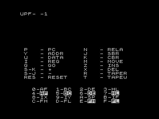

# Introduction

The Micro-Professor (MPF-1) is a single-board, Z80-based computer produced by Multitech (who are now known as Acer) and first released in 1981.

The MPF-1 was intended to teach people about microprocessors, machine-code programming, and electronics. The computer came housed in a book-like case with a seven-segment LED display and a 32-key keypad.

The MPF-1 shipped with 2 kilobytes of RAM and a built-in monitor program for entering, running, and debugging machine-code programs. Multitech also provided a range of expansion options including a BASIC interpretter ROM, memory expansion, EPROM programmer, and a thermal printer (the software for which included a Z80 disassembler). 

For more information on the Micro-Professor, see [https://electrickery.nl/comp/mpf1](https://electrickery.nl/comp/mpf1).

MPF-1s do occasionally appear on auction sites, but tend to be very expensive. Given this, I thought it would be good if people could experience some of the fun of using an MPF-1 without the expense. To this end, I have ported the MPF-1 monitor to the Minstrel 4th (or Minstrel 4D). I also ported the thermal-printer ROM (creating a virtual, on-screen printer), so people could access the disassembler and memory-dump features.

The Monitor can be run in two modes:

- Ideally, if you have an EPROM programmer and a suitable EPROM chip, you can write a new ROM image for your Minstrel 4th. This will give a more realistic (though still not perfect) experience.

- Alternatively, you can load the monitor into RAM and run it from there. This works reasonably well though you need to be careful to avoid using zero-page restart instructions (such as `rst 0x38`) replacing them by suitable calls (something like, `call 0x4038`). You also cannot use Reset in RAM version (see note below), so you can get stuck if your program has a bug and careers off into memory it is not meant to.

Even the ROM version is missing some functionality, related to debugging and single-stepping. For this, the MPF-1 uses the non-maskable interrupt line and a timer provided by a [74LS90](https://www.ti.com/lit/ds/symlink/sn54ls90.pdf) integrated circuit. To generate an NMI, on the Minstrel 4th, would require an expansion device (such as an RC2014 card).

Except for this, the port works well: the various Monitor subroutines, listed in the [User Manual](https://electrickery.hosting.philpem.me.uk/comp/mpf1/doc/MPF-1_usersManual.pdf) and the [PRT-MPF-IP User Manual](https://electrickery.hosting.philpem.me.uk/comp/mpf1/doc/prt-mpf-IP.pdf), are available and, based on my testing so far, the various projects and examples (also in the User Manual) work as expected.


## Loading the MPF-1 Monitor on your Minstrel 4th

The procedure for accessing the MPF-1 Monitor depends on which version of the monitor you plan to use.

### ROM image

The MPF-1 ROM image 'mpf_1.rom' can be burned onto a suitable EPROM and installed into the Minstrel 4th or Minstrel 4D. Jumpers/ switches on the main board allow you to select between multiple ROMs, so you could set up the standard AceForth ROM in the first ROM bank and the MPF-1 Monitor in the second, for example (see Minstrel 4th User Guide for more information).

Once installed, check the jumpers/ switches are configured to select the correct ROM bank and power on. The MPF-1 should boot as shown in the screenshot.

The ROM image 'mpf-1.rom' has been padded out to 16 kilobytes to fill the ROM bank, even though the Minstrel 4th only addresses the first 8 kilobytes. This means the ROM will probably not work on an emulator (which will expect an 8-kilobyte ROM). To this end, I have also provided 'mpf-1_8k.rom', which is confirmed to work on the EightyOne emulator, at least.



### RAM-based

Power on your Minstrel 4th and load the mmonitor from 'mpf.tap' (or 'mpf.wav') using the following command (case of filename is important):

```
  16384 0 BLOAD MPF1
```

Then, start the monitor by typing:

```
  16384 CALL
```

All going well, you should be greeted with the MPF-1 startup message "UPF--1".


## Using the MPF-1

The real MPF-1 has just 36 keys and a seven-character display. Because of this, the Minstrel 4th output is limited to the top line of the screen and only a subset of the keys are used, as follows:

- 0, 1, ..., 9, A, ..., F -- represent hexadecimal digits (or register pairs, when inspecting the Z80 registers)
- P - `PC`
- Y - `ADDR`
- U - `DATA`
- I - `REG`
- Shift-K - `+`
- Shift-J - `-`
- G - `GO`
- J - `SBR` (not very functional)
- K - `CBR` (not very functional)
- M - `MOVE`
- N - `RELA`
- Z - `INS`
- X - `DEL`
- R - `TAPE RD`
- T - `TAPE WR`
- Reset - `RESET` (ROM version only)

The key mapping is displayed on-screen whenever you are using the MPF-1 Monitor, so there is no need to memorise the list above.

The easiest way to get familiar with the MPF-1 is to read the [user manual](https://electrickery.hosting.philpem.me.uk/comp/mpf1/doc/MPF-1_usersManual.pdf), but bearing in mind the following changes for the Minstrel 4th environment:

- User memory starts at 0x4000 (ROM version)/ 0x8000 (RAM version), not 0x1800. E.g., pressing `PC` when you first start the monitor will report the user's PC as being 0x4000 (or 0x8000).

- Where the Micro-Professor uses fullstops to indicate status on the display, the Minstrel 4th port uses inverse video.

- The following keys are not implemented: `STEP`, `MONI`, `INTR`, and `USER KEY`. These require additional hardware to implement. However, some of the functionality of `MONI` can be accessed via the `HALT` routine, described below.

- While you can set and clear a breakpoint, this is ignored (again, breakpoints require extra hardware to implement).

- The Monitor subroutines noted in Section 5 of the User Manual work, though for the RAM version of the monitor, entry points are all offset by 0x4000 -- e.g., the entry point for SCAN is 0x45FE (not 0x05FE, as noted in the manual).

- Most examples in the user manual end with a `HALT` command. The manual tells you to press `MONI` to return to the Monitor. However, this will not work as `MONI` is not implemented. To work around this, I have provided an additional routine called `HALT` accessed at addresss 0x0800 (or 0x4800). Whenever you see a `HALT` instruction in the example code, replace this with `CALL HALT` (that is, 0xCD, 0x00, 0x08). This call will save the state of your program (registers, stack, etc.) and wait for you to press any key, at which point it will jump to the NMI routine (simulating the effect of pressing `MONI`).

### Saving Your Work

Saving to and loading from tape is supported. However, the port uses the Jupiter Ace code block format. This has the advantage that you can use files with either the MPF-1 ROM or the Jupiter Ace Forth ROM. Note, though, that the MPF-1 identifies files by four-digit hexadecimal numbers, You will only be able to load a code block written by the Jupiter Ace ROM if you use a four-character filename that corresponds to a hex number (e.g., `16384 128 BSAVE 1234` to write a code block that can be read into the MPF-1 Monitor using file id 1234h).

If you are using the MPF-1 ROM image, you can load the examples from the User Manual from the audio files, named [mpf1_um_example_1.wav], etc.

### Reset

The MPF-1 interprets Restart (that is, a call to memory address 0x0000) as a warm restart of the Monitor, without affecting any user code or data in memory. This provides a useful way to recover from a bug that sends your program into memory it should not be accessing. Pressing the Reset key on the Minstrel 4th will stop your program and reset the Monitor. However, your program will still be in memory, so you can debug it (assuming it has not been corrupted by the bug).

Note that this does not work for the RAM-based version of the Monitor. For this version, Reset will run the Ace ROM reset function which wipes the RAM, losing both user code and the monitor itself.

### Memory Map

The Minstrel 4th version of the Monitor has a simplified memory map compared to the MPF-1.

The monitor program is located either at 0x0000 (ROM version) or 0x4000 (RAM version). For the RAM version, the usual Ace Forth ROM resides at 0x0000.

User RAM either starts at 0x4000 (ROM version) or 0x8000 (RAM version). The system variables are stored from 0x3C00 (ROM version) or 0x7C00 (RAM version), the system stack grows down from the start of user memory and the user stack (by default) grows down from the start of user memory-0x80 (that is, either 0x3F80 or 0x7F80).

As in the Minstrel 4th, the display map is stored at 0x2400 (and 0x2000) and the character set RAM is stored at 0x2800 (or 0x2C00). 

### Printer Support

A popular add-on for the Micro Professor was a small thermal printer called the PRT-MPF-IP printer. A key advantage of the printer was the ability to have more than the six characters of the LED display visible at once -- the printer software (supplied on a ROM) included both a Z80 disassembler and a memory-dump utility, which made it much easier to check and debug your code.

I have also ported the printer software to run on the Minstrel 4th (ROM-based version, only), exploiting the mostly unused 24x32 charater display of the Minstrel 4th to act as a virtual printer.

The disassebler and memory-dump utility work as described in the manual, with a couple of exceptions:

- The entry point for the routines has changed. The disassembler is access from address 0x1020 and the memory-dump utility is access from address 0x1324.

- The virtual printer stops every 16 lines (that is, one screenfull) and prompts you to press any key to scroll.

I have not ported the BASIC programming ROM and so have also not updated the BASIC listing routine in the printer ROM. You can call the routine (at address 0x141b) but it will produce nonesense.

Some of the other routines, documented in the user guide are also available, though are possibly less useful:

- `PLINE` can be accessed at 0x168E to scroll the virtual printer by two lines

- `PLINEFD` can be accessed at 0x13EC to issue a line feed

- `MTPPRD` can be accessed at 0x15C7 to print a line of text, but you must first call `PLINEFD` to initialise/ reinitialise the virtual printer immediately before each and every call to `MTPPRD`. On exit from `PLINEFD`, the HL register pair will be set to the start address for the printer buffer, which must be passed to `MTPPRD`. Failing to initialise the virtual printer will likely crash the MPF-1.

*Note:* Printer support is only usable on the ROM-based version of the monitor. While you can call the various printer routines in the RAM-based version (adding 0x4000 to the relevant call address), there is no way to exit back to the monitor, as this requires a soft reset.

## Implementation

The port of the monitor is based on a commented disassembly by fjkraan@electrickery.nl, which is available from [https://electrickery.nl/comp/mpf1](https://electrickery.nl/comp/mpf1). The modified source code should be able to be assembled with any standard Z80 cross-assembler (I use [the non-GNU z80asm](https://savannah.nongnu.org/projects/z80asm/)).

I have made the following changes to the source code so that the Monitor will run on the Minstrel 4th:

- Set all of the port address for to 8255 chip to 0xFF, as this version does not use that chip and I wanted to avoid interfering with peripherals.

- Quadrupled the frequencies of the parameters F1KHZ and F2KHZ to accommodate both doubling of the clock speed and the fact that the Minstrel 4th version will oscillate the speaker twice as often as the MPF-1 did.

- For the RAM version, the origin address is set to 0x4000, so code is built to run in RAM (plus removed other origin directives later in the source, replacing them by 'ds' commands to ensure same code layout in memory.

- For the RAM version, references to user RAM (e.g., RESET1 routine and RST38) have been updated to point to the correct location in user RAM.

- Changed the scroll rate for power-on message (in INI1).

- Replaced speaker oscilator code with Minstrel 4th equivalent (issuing IN and OUT to port 0xFE).

- Updated the code in SETPT and LOCPT to set bit 7 (inverted characters) instead of printing decimal point.

- Reimplemented SCAN1 to use Minstrel 4th display and keyboard.

- Written a conversion routine to translate between the MPF-1 character encoding (corresponds to bit pattern required for LED display) and the standard Ace character encoding.

- Modified tape routines to use Jupiter Ace tape interface, which has been commented and copied into the MPF-1 ROM.

The port of the printer PRT-MPF-1P ROM is based on a disassembled version of the HEX file (available from [https://electrickery.nl/comp/mpf1](https://electrickery.nl/comp/mpf1)). I have added modest comments to the resulting source file [prt-ib.asm](prt-ib.asm), though plan to improve these comments over time.

## Further reading

- (Tynemouth Software's Blog article about repairing a Micro-Professor 1)[http://blog.tynemouthsoftware.co.uk/2023/05/multitech-micro-professor-mpf-i-repair.html]. 
