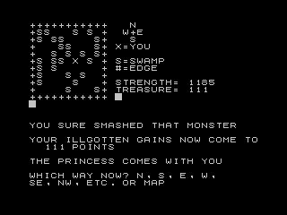

# Perilous Swamp

This is a port of the ZX81 adventure game, Perilous Swamp, to Tree Forth of the Minstrel 4th. It follows the original game quite closely but takes advantage of some of the features of Tree Forth to give a (hopefully) enhanced experience. In particular, it uses Tree Forth's virtual screens to keep the game map and game stats on screen, alongside the interactive game-play text.

The current version is a basic port: it is a complete game, but lacks many of the special features of the original. I plan to continue adding to the game, to make it a more comprehensive port.

## Playing Perilous Swamp

To play the game, you need a Minstrel 4th set up with [my port of the Tree Forth ROM](https://github.com/markgbeckett/zx81/tree/main/zx-forth).

As the Tree Forth port relies on the Minstrel 4th's support for an expanded ROM, this game cannot be run on an original Jupiter Ace, nor in an emulator.

You load the game using the Minstrel 4th's tape interface. Connect the ear socket to the audio out of a PC or MP3 player, pre-loaded with the WAV audio file of the game [perilous_swamp.wav](perilous_swamp.wav).

To load the game:

- Power on the Minstrel 4th.
- Press Shift-1 to switch to split-screen editor-and-console mode
- Enter `CON` to enable auto-compilation of screens
- Enter `1 LOAD` and start playback of the WAV file.
- The game will load as a series of screens, taking around 7 minutes.
- Once loaded, type `SWAMP` to begin the game.

Each screen is compiled automatically, before the subsequent screen starts loading. Gaps in the WAV file ensure there is enough time to compile each screen before starting to load the next screen: you do not need to pause playback during the process.

To successfully load the game may take a little trial and error to get the volume level correct. Disabling any audio enhancements for playback will also improve the reliability of loading.

Consult the instructions from the [original ZX81 game](https://www.zx81stuff.org.uk/zx81/tape/FantasyGames), for how to play.

## Background

Perilous Swamp is a turn-based, text adventure game, written for the ZX81 and published by Psion in 1981. It was released as side 1 of a two-game bundle called Fantasy Games. The aim of the game is to rescue the Princess from a mysterious swamp, without being killed by the various malevolant inhabitants.

Perilous Swamp is written in BASIC and the mechanic is quite simple. However, completing the game will take a mix of practice and luck. The game has some humour plus the playing area is randomly generated, making for an entertaining game and meaning you get a different game each time you play.

I decided to port the game to gain experience of the Tree Forth development environment, plus I had enjoyed playing the game on the ZX81 and wanted to play it on the enhanced hardware of the Minstrel 4th.

