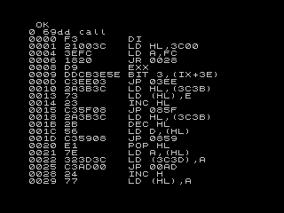

# Introduction

A Z80 disassembler is a useful tool to have to hand, both for developing and debugging machine-code programs and for interrogating the computer's ROM routines.

This project takes a compact Z80 disassembler, developed by Toni Baker and described in her book [Machine Code Programming for Your ZX Spectrum](https://ia600604.us.archive.org/view_archive.php?archive=/1/items/World_of_Spectrum_June_2017_Mirror/World%20of%20Spectrum%20June%202017%20Mirror.zip&file=World%20of%20Spectrum%20June%202017%20Mirror/sinclair/books/m/MasteringMachineCodeOnYourZXSpectrum.pdf), and generalises it so it can be used on a range of Z80-based microcomputers (specifically, targetting the Minstrel 4th and Minstrel 2).

Toni's Z80 disassembler is designed to be as compact as possible, occupying around 1.25 kB, meaning it can easily coexist with other development tools and any program being developed. Further, for the Minstrel 4th, it can be added to the Ace Forth ROM, in the extra space at 0x2800--03BFF (see (Minstrel Goes Forth)[http://blog.tynemouthsoftware.co.uk/2020/05/minstrel-goes-forth.html]).

The disassembler includes a hex-dump function that is useful for checking numeric or character data that is stored alongside a machine-code program. The hex dump displays the content of memory both in hex and the machine's character set.

## Usage

For this project, I have provided source code: you would typically build your own package for your specific system and requirements. To help, I have included three example 'ports' of the disassembler -- for the Minstrel 4th, the Minstrel 2 (4K ROM) and the ZX Spectrum. Along with these notes, these should help you get started.

The source code can be assembled with any standard Z80 cross-assembler (I have used [the non-GNU z80asm](https://savannah.nongnu.org/projects/z80asm/)). I have included a [Makefile](Makefile) to help with this.

To start the disassembler, you should run/ call the machine-code routine labelled `START`. The address from which to disassemble needs to be stored a the word labelled `ADDRESS` (see below). This could be set from the calling routine or as part of `INIT` (again, see notes below). For example, in the Minstrel 2 implementation, I have POKE'd the start address before calling the disassembler. In contrast, the Minstrel 4th version pops a start address from the stack (in `INIT`) and copies it into `ADDRESS`.

To start a hex dump, you should run/ call the machine-code routine labelled `HDUMP`. Again, the start address is specified in `ADDRESS`.

To make the disassembler more portable, I have partitioned the program into two parts:

- [z80_disassembler.asm](z80_disassembler.asm), which contains the core of Toni's Z80 disassembler implementation in a form that can run on almost any Z80 platform with sufficient resouces (most notably, memory). I have also provided detailed comments to explain how this works. There should be no reason to change this file, unless you wish to change or extend the disassembler's functionality.
- A platform-specific wrapper (e.g., see [z80_dis_ace.asm](z80_dis_ace.asm)) that contains implementations of system variables, initialisation, and screen handling tailored to the requirements of a specific platform and usage. This is the file you need to create for your system and requirements.

Probably the easiest way to create a new port is to start from one of the existing platform-specific wrappers: whichever one seems most similar to your target system and use.

The platform-specific wrapper needs to include the following elements:
- A character-code mapping file that maps, at least, the alphanumeric characters (A-Z (capitals) and 0-9), space, carriage return, parentheses, comma, plus symbol, an apostrophe, and a null character (Space is fine) to the generic labels, as illustrated in [jupiter_chars.asm](../utilities/jupiter_chars.asm) (note: [jupiter_chars.asm](../utilities/jupiter_chars.asm) is a generic character-code mapping file, which defines many more character codes than are needed for the disassembler). In fact, for any system that uses ASCII-like character coding, the Ace definition file is likely to be good enough (possibly with some tweaks).
- A buffer with space for at least 32 bytes, in RAM, pointed to by the label `DISS`. This is used by the disassembler to store the current command being disassembled. For example, for the Minstrel 4th port, I set `DISS` to point to the beginning of the PAD at address 0x2701 (see Chapter 16 of Steven Vickers' manual 'Jupiter Ace FORTH Programming').
- A label named `ADDRESS` that points to a word (two bytes) in RAM that can be used by the disassembler to store an address. For the Minstrel 4th, I have specified the last two bytes of PAD, at address 0x27FE.
- Five `equ` instructions defining character codes that are mapped to `EXT_ADDR`, `IND_ADDR`, `IMM_ADDR`, `IMM_EXT_ADDR`, and `REL_ADDR` and that the disassembler can use to note special decoding for the command being disassembled. You should choose codes that do not coincide with the printable letters, numbers, and symbols listed in the requirements for the character-code mapping file above. On most systems, codes 0, 1, 2, 3, and 4 are suitable. The only exception I have found is the Minstrel 2, which maps printable characters onto these codes.
- A callable routine, labelled `INIT`, which does any system-specific initialisation you need. The `INIT` routine provides an opportunity to set the address from which to start disassembling (that is, the contents of ADDRESS). So, for example, the Minstrel 4th version pops the word off the top of stack and stores it in ADDRESS, making it easy to set the start address for disassembly from FORTH. No arguments are passed to this routine and there are no requirements from the disassembler to preserve registers.
- A callable routine, labelled `PRINT_A`, which will insert the character code in the A register at the current print position and advance the print position by one character. The routine must preserve all current and alternate registers except for A and F. This routine should recognise the carriage-return character and interpret it as a request to move print position to the start of the next line.
- A callable routine, labelled `TAB`, which will set the print position (system-specific) to column 14 on the current line. On entry, you may assume that the print position is to the left of column 14 on the current line. The routine must preserve all current and alternate registers except for A and F.
- A callable routine, labelled `CHECKPRINTABLE`, which will check if the character code in the A register is printable and, if it is not, replace it with a printable character (such as a fullstop). The routine should preserve all registers except for C and return the resulting character in A.

Some other things to be aware of:
- The disassembler will continue to disassemble commands without stopping unless you implement a stop or pause operation (probably in PRINT_A) or the ROM print routine does this for you. On the ZX Spectrum port, there is nothing to do here, as the built-in character print routine `RST 0x10` tracks how many lines have been output and prompts the user with "Scroll?" when the screen is full. For the Minstrel 4th port, I have included a counter that tracks the number of lines that have been printed and pauses (waiting for a key press) whenever the screen is full. I've also set the program to check for the Space key and to stop if it is pressed.

## Further reading

* [Machine Code Programming for Your ZX Spectrum](https://ia600604.us.archive.org/view_archive.php?archive=/1/items/World_of_Spectrum_June_2017_Mirror/World%20of%20Spectrum%20June%202017%20Mirror.zip&file=World%20of%20Spectrum%20June%202017%20Mirror/sinclair/books/m/MasteringMachineCodeOnYourZXSpectrum.pdf) -- Toni Baker's implementation of the disassembler is included in Chapter 17.
* [Decoding Z80 Opcodes](http://www.z80.info/decoding.htm) -- a description of the algorithm that has been implemented.
